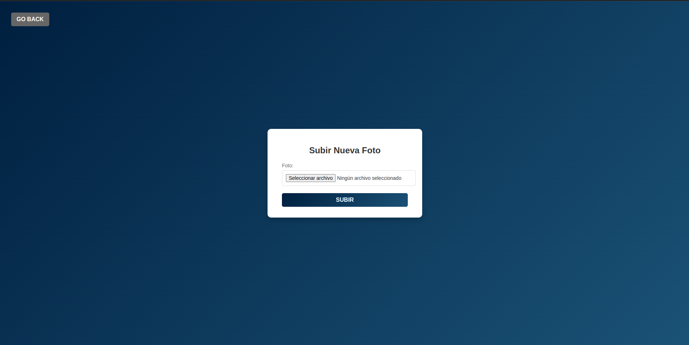
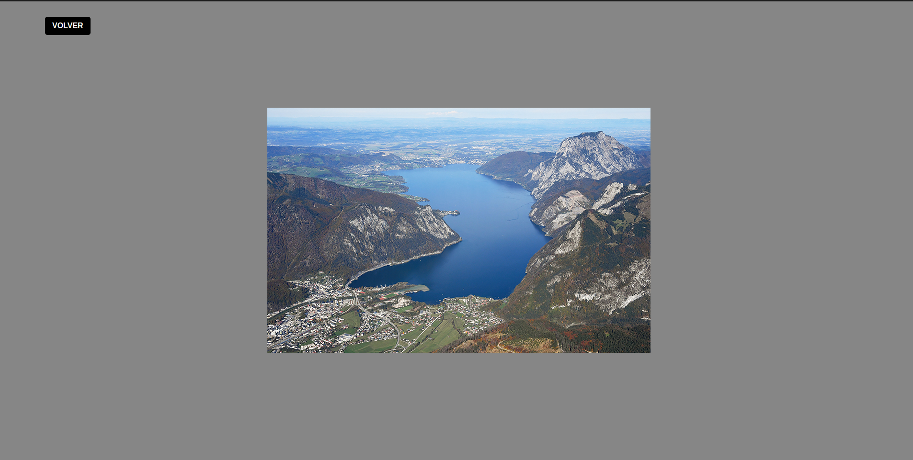

## Este proyecto consiste en una aplicacion para subir archivos a modo de galeria y estará hecha en laravel.

##### Login de la aplicacion

En este login se incluye un formulario para que cada usuario se pueda loguear introduciendo sus credenciales(email y password) y un boton que te permite registrarte si no lo estas. 

#### Sign In de la aplicacion

En este signin se incluye un formulario para que cada usuario se pueda registrar introduciendo su nombre su email y su contraseña. Si el registro sale correctamente te redirige al login, sino te imprime un mensajito indicando lo que ha fallado y utilizando el metodo old para que el usuario no tenga que volver a escribir lo que ya ha puesto salvo la contraseña que eso por motivos de seguridad es mejor no guardarla con old. 

#### Index de la galeria para cada usuario

Si el usuario esta logueado vemos que le apareceran las imagenes que haya guardado o insertado en la base de datos pero las suyas unicamente, de nadie mas ya que eso rompería la lógica de lo que consiste una galería. Esta vista incluye ademas por cada foto 3 botones para administrar las fotos de la manera que deseemos, ya sea verla mas en profundidad(view), editarla(edit) o eliminarla(delete).

Ademas se nos incluye un boton para añadir nuevas imagenes y otro boton en la esquina superior izquierda para cerrar sesion(log out).

#### Pagina de subir imagenes

En la pagina de subida de imagenes como podéis apreciar aparece una ventanita con un campo que contiene un boton para seleccionar archivos si le damos
nos abrirá el explrador de archivos para que elijamos la foto que queremos subir.

Ademas se incluye un boton de go back por si nos arrepentimos y no queremos subir ninguna imagen.

#### Pagina de edición de la imagen

En la pagina de edicion como se puede apreciar nos deja editar el nombre de la imagen incluso podemos quitar su extension, ya que esta misma 
la cojo de la base de datos con lo cual no produce conflicto a la hora de editar el nombre de la imagen.

#### Eliminación de la imagen 

Para la eliminación de una imagen utilizaremos JavaScript para que nos muestre una ventanita que servirá para que el usuario nos confirme la eliminación de la imagen si de verdad quiere hacerlo.

#### Vista en profundidad de la imagen con usuario

En esta pagina se nos muestra la imagen con la resolucion de pixeles que contenga a estilo visualizador de imagenes de chrome y un boton para volver a la home.

## Author: Jose Ángel Macías Aguilera.